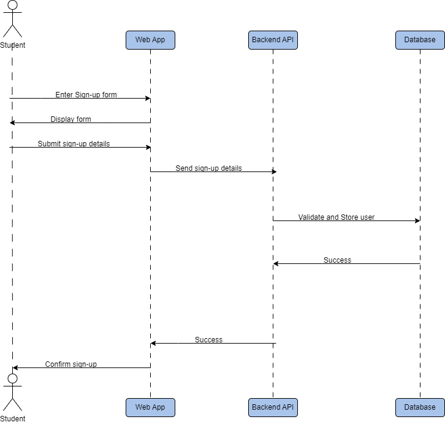
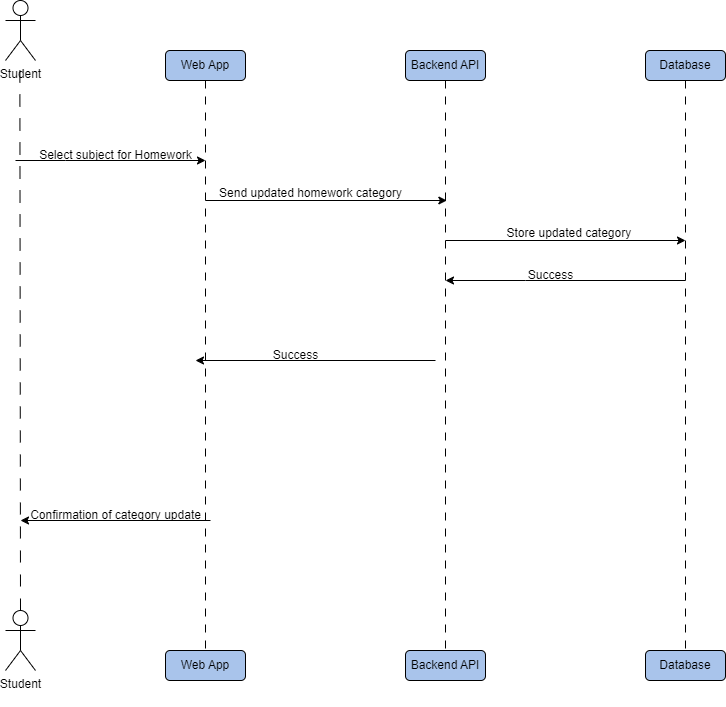

# PROJECT Design Documentation

## Team Information

- Team name: TEAMNAME
- Team members
  - Uzair Mukadam (umm7905)
  - Jahnavi Kaja (jk4266)
  - Devaj Mody (dm9395)
  - Shridhar Vilas Shinde (ss7536)

## Executive Summary

Homework Tracking is a web application built used to assist students in managing their weekly homework assignments. The primary users of this application are students, who can easily add and organize their homework tasks.

Many students often feel overwhelmed by their weekly workload, which can lead to missed assignments and potential mark deductions. This application offers a convenient solution for students to keep track of all their homework, helping them avoid unnecessary point losses and stay on top of their academic responsibilities.

## Requirements

This section describes the features of the application.

### Definition of MVP

The Minimum Viable Product (MVP) for our Homework Tracking app focuses on providing students with a basic tool to manage their weekly assignments. In this version, students can sign up, log in, add new homework tasks, assign due dates, categorize tasks by subject, and mark them as completed. A simple calendar view helps students see all their homework in one place. Admins will have basic account management functions like creating and managing student accounts. This MVP aims to help students stay organized and avoid missing homework deadlines.

### MVP Features

### User Authentication:

- Sign Up: Allows students to create an account.
- Log In: Allows students to securely access their account.
- Password Change: Allows students to change their account password.

### Homework Management:

- Add New Homework Assignments: Students can add new tasks and track them.
- Set Due Dates for Assignments: Students can specify deadlines to manage their time.
- Mark Assignments as Completed: Helps students track their progress by marking tasks as done.
- Categorize Homework by Subject: Allows students to organize tasks by subject for better clarity.
- View Calendar of Assignments: Displays all homework on a calendar view, helping students see their workload at a glance.

## Architecture and Design

This section describes the application architecture.

### Software Architecture

> _Place a architectural diagram here._ > _Describe your software architecture._

### Use Cases

**Actors**: The diagram includes two actors: Student and Admin.

**Use Cases**: Within the "Homework Tracking System" package, there are several key use cases outlined:

Student-related use cases:

- Sign Up: Allows students to create a new account in the system.
- Log In: Enables students to securely access their account.
- Change Password: Allows students to change their account password for security purposes.
- Add Homework: Students can add new homework assignments to their tracker.
- Set Due Dates: Enables students to set deadlines for their assignments.
- Mark as Completed: Students can mark assignments as finished, helping them track progress.
- Categorize by Subject: Allows students to organize their homework by subject or class.
- View Calendar: Displays all assignments in a calendar view for better time management.

Admin-related use case:

- Manage Accounts: Admins can create and manage student accounts, including tasks such as creating new accounts, resetting passwords, or deactivating accounts if necessary.

### Acceptance Criteria

- **User Story** : As a student, I want to create an account so that I can start tracking my homework.

  - **Acceptance criteria**:
    - Users must be able to create an account using a valid email address and password
    - Password must be at least 8 characters long and contain at least one number and one special character
    - System should display an error message if the email is already registered
    - Upon successful registration, users should receive a confirmation email

- **User Story** : As a student, I want to log into my account so that I can access my homework information.

  - **Acceptance criteria**:
    - Users should be able to log in using their registered email and password
    - System should display an error message for incorrect credentials
    - Users should be redirected to their dashboard upon successful login
    - A "Forgot Password" option should be available on the login page

- **User Story** : As a student, I want to change my password so that I can keep my account secure.

  - **Acceptance criteria**:
    - Users must be able to change their password while logged in
    - System should require users to enter their current password before setting a new one
    - Users should receive an email notification when their password is changed
    - The new password must be different from the current password

- **User Story** : As a student, I want to add new homework assignments so that I can keep track of my tasks.

  - **Acceptance criteria**:
    - Users must be able to create a new homework assignment with a title and description
    - Each homework entry must have a required subject field
    - System should automatically save the creation date and time for each assignment
    - Users should be able to set a priority level for each assignment (High, Medium, Low)

- **User Story** : As a student, I want to set due dates for my assignments so that I can manage my time effectively.

  - **Acceptance criteria**:
    - Users must be able to set a due date for each homework assignment
    - System should prevent setting due dates in the past
    - Users should receive a warning if they set a due date less than 24 hours in the future
    - Due dates should be displayed in a clear, consistent format throughout the application

- **User Story** : As a student, I want to mark assignments as completed so that I can track my progress.

  - **Acceptance criteria**:
    - Users should be able to mark any homework assignment as completed
    - Completed assignments should be visually distinct from incomplete ones
    - System should record the completion date when an assignment is marked as done
    - Users should have the option to unmark completed assignments if needed

- **User Story** : As a student, I want to categorize my homework by subject so that I can organize my assignments better.

  - **Acceptance criteria**:
    - Users must be able to select from a predefined list of common subjects
    - Users should have the option to create custom subject categories
    - System should allow filtering homework assignments by subject
    - Each subject should have a distinct color coding for easy visual identification

- **User Story** : As a student, I want to view a calendar of my assignments so that I can plan my study schedule.

  - **Acceptance criteria**:
    - Calendar should display all homework assignments on their respective due dates
    - Users should be able to toggle between daily, weekly, and monthly calendar views
    - Clicking on a calendar entry should show the full details of the homework assignment
    - Calendar should use color coding to differentiate assignments by subject

- **User Story** : As an admin, I want to manage user accounts so that I can ensure proper system usage.
  - **Acceptance criteria**:
    - Admins should be able to view a list of all registered users
    - Admins must be able to deactivate user accounts when necessary
    - System should provide admins with the ability to reset user passwords
    - Admins should be able to see basic usage statistics for each user account

### Domain Model Diagram

<<<<<<< HEAD
> _Place a class diagram here._ > _Describe your class diagram._

### Sequence Diagram

> Sequence Diagrams in images folder starting with "sequence_"

=======

### Sequence Diagram

- sign-up sequence diagram

- login sequence diagram

- change password sequence diagram

- add assignment sequence diagram

- set homework category sequence diagram

- set homework due-date sequence diagram

- mark assignment complete sequence diagram

- view assignment calendar sequence diagram

### Software Architecture

- For our project, we've chosen the Model-View-Controller (MVC) architecture. This approach allows us to break down the application into distinct, manageable components, which simplifies maintenance and enhances organization. By separating these components, we can work on different parts of the application simultaneously, improving efficiency and fostering parallel development.
  

### Class Diagram
  

